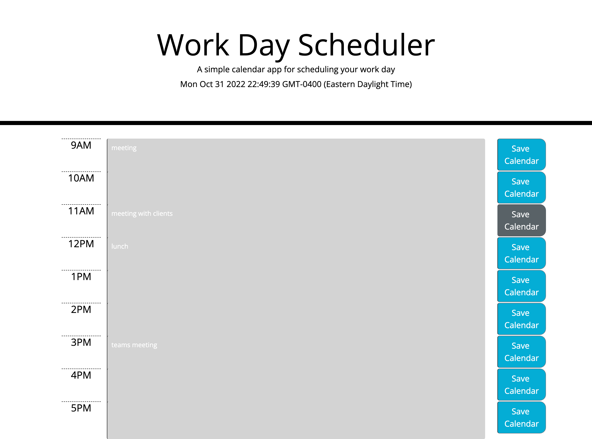

# Workday Scheduler Module Challenge

## Project Purpose
The purpose of this project is to allow an employee with a busy schedule to add events to the daily planner to help with managing their time more effectively.

## HTML

* Added bootstrap textarea as well as div elements that contain the calendar time and save button elements. 

* Utilized Bootstrap styling within HTML elements to make a clean presentable display for the user. 

* Added CSS class names already within the CSS file to the HTML calendar div elements to add styling to the page.

## Javascript

* Created coding to utilize Javascript to display the current date and time to the user on the Jumbotron display within the HTML.

* Created function to save the texted entered to the calendar utilizing the user's localstorage.

    * Used 'for loop' within this function to loop through calendar text and save new information added to localStorage. 

    * 'JSON.stringify' used to take information and store to the user's localStorage

* Created function to reload the saved user's calendar events from localStorage on page load for the user. 

    * Use 'if statement' and 'for loop' within this function to loop through the array and also change the textarea display color based on the current hour of the day and the displayed time on the calendar.

* Added a function call for window.onload that will call the 'reloadToCalendar' function and load saved events from localStorage for the user.

* Added a button click event listener using JQUERY to listen for a click from the user and save anything entered into the textarea to localStorage.

## Links

[GitHub](https://github.com/j-faust/workday-planner)

[Workday Scheduler Website](j-faust.github.io/workday-planner)

## Screenshots

